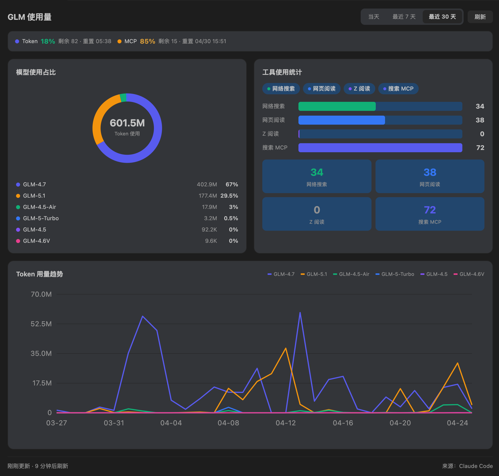
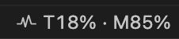
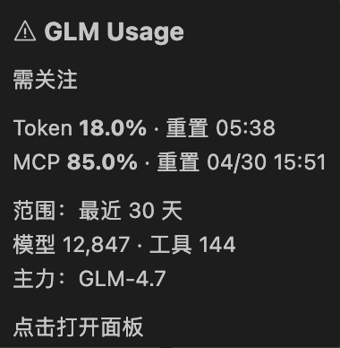

# GLM Usage Monitor

> 在 Visual Studio Code 中直接监控您的 GLM Coding Plan 使用量

## 界面预览

<table>
  <tr>
    <td align="center"><b>详情面板</b></td>
    <td align="center"><b>状态栏</b></td>
     <td align="center"><b>Tooltip</b></td>
  </tr>
  <tr>
    <td></td>
    <td></td>
    <td></td>
  </tr>
</table>

## 功能特性

- **环形图占比分析**：可视化展示各模型 Token 使用占比，一目了然
- **工具使用柱状图**：以柱状图和数字卡片展示各工具调用次数
- **Token 趋势折线图**：按模型分色展示 Token 用量随时间的变化趋势
- **配额实时监控**：在顶部摘要条展示 Token 配额和 MCP 配额的百分比、剩余量和重置时间
- **状态栏集成**：精简格式显示用量百分比，悬停查看详细 Tooltip
- **离线支持**：断网时自动回退缓存数据，并显示离线标识
- **套餐类型展示**：自动识别并显示当前套餐类型
- **自动刷新**：可配置的自动刷新间隔（默认：10 分钟）
- **时间窗口分析**：支持今日、近 7 天、近 30 天三种时间范围
- **安全凭证存储**：API 密钥安全存储在 VS Code 的 secret storage 中
- **自动配置**：自动读取 Claude Code 配置文件中的凭证

## 系统要求

- Visual Studio Code 1.80.0 或更高版本
- GLM Coding Plan API 凭证

## 安装

1. 打开 Visual Studio Code
2. 进入扩展面板（Ctrl+Shift+X）
3. 搜索 "GLM Usage Monitor"
4. 点击安装

## 快速开始

### 方式一：自动配置（推荐）

如果您已经配置了 Claude Code，扩展会自动使用 `~/.claude/settings.json` 中的凭证，无需额外配置。

### 方式二：手动配置

1. **配置 API 凭证**
   - 打开命令面板（Ctrl+Shift+P / Cmd+Shift+P）
   - 运行 "GLM Usage: Configure"
   - 输入您的 API Base URL（默认：`https://api.z.ai/api/anthropic`）
   - 输入您的 API 密钥

2. **查看使用量**
   - 点击状态栏项目或运行 "Show GLM Usage Panel" 命令
   - 查看配额状态、模型占比、工具统计和用量趋势

## 面板说明

面板由以下区域组成：

| 区域         | 说明                                                            |
| ------------ | --------------------------------------------------------------- |
| 顶部摘要条   | Token / MCP 配额百分比、剩余量、重置时间，离线时显示离线标识    |
| 模型使用占比 | 环形图展示各模型 Token 占比，下方图例列出模型名称、用量和百分比 |
| 工具使用统计 | 彩色标签 + 柱状图展示各工具调用次数，底部数字卡片强化数据对比   |
| Token 趋势   | 按模型分色的折线图，支持 hourly/daily 粒度自适应                |
| 套餐标签     | 标题旁显示当前套餐类型                                          |

### 状态栏

状态栏显示当前用量百分比，格式为 `T{token}% · M{mcp}%`。颜色随用量变化：

- 绿色：< 80%
- 黄色：80% - 95%
- 红色：≥ 95%

悬停状态栏可查看详细 Tooltip，包含配额、重置时间、调用统计和主力模型。

## 命令

| 命令                        | 描述                  |
| --------------------------- | --------------------- |
| `glmUsage.showUsage`        | 显示 GLM 使用量面板   |
| `glmUsage.refresh`          | 刷新使用量数据        |
| `glmUsage.changeRange`      | 切换时间范围          |
| `glmUsage.configure`        | 配置 API 凭证         |
| `glmUsage.clearCredentials` | 清除已存储的 API 凭证 |
| `glmUsage.diagnose`         | 诊断凭证配置          |

## 设置

| 设置                              | 类型     | 默认值                           | 描述                                     |
| --------------------------------- | -------- | -------------------------------- | ---------------------------------------- |
| `glmUsage.baseUrl`                | string   | `https://api.z.ai/api/anthropic` | GLM API 基础 URL                         |
| `glmUsage.refreshInterval`        | number   | `600000`                         | 自动刷新间隔（毫秒）                     |
| `glmUsage.autoRefresh`            | boolean  | `true`                           | 启用/禁用自动刷新                        |
| `glmUsage.statusBarMode`          | string   | `detailed`                       | 状态栏模式：minimal / compact / detailed |
| `glmUsage.cacheEnabled`           | boolean  | `true`                           | 启用/禁用数据缓存                        |
| `glmUsage.notificationThresholds` | number[] | `[50, 80, 95]`                   | 用量阈值提醒百分比                       |
| `glmUsage.notificationEnabled`    | boolean  | `true`                           | 启用/禁用用量阈值提醒                    |

## 凭证配置优先级

扩展按以下优先级获取 API 凭证：

1. **Claude Code 配置文件** (`~/.claude/settings.json`)
2. **VSCode 进程环境变量**
3. **手动配置的凭证**

## 隐私与安全

- 您的 API 密钥安全存储在 VSCode 的 secret storage 中
- 不向任何第三方服务发送使用量数据
- 所有 API 调用直接发送到配置的 GLM API 端点

## 许可证

MIT License - 详见 [LICENSE](LICENSE)

## 支持

如有问题、功能建议或疑问，请访问 [GitHub 仓库](https://github.com/volcanicll/glm-usage-monitor)

## 更新日志

详见 [CHANGELOG.md](CHANGELOG.md)
